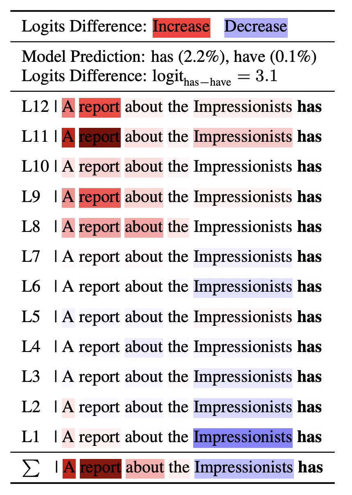

# Explaining How Transformers Use Context to Build Predictions

### Code of the paper [Explaining How Transformers Use Context to Build Predictions](https://arxiv.org/pdf/2305.12535.pdf)
## Abstract
<p>
<em>
Language Generation Models produce words based on the previous context. Although existing methods offer input attributions as explanations for a model's prediction, it is still unclear how prior words affect the model's decision throughout the layers. In this work, we leverage recent advances in explainability of the Transformer and present a procedure to analyze models for language generation. Using contrastive examples, we compare the alignment of our explanations with evidence of the linguistic phenomena, and show that our method consistently aligns better than gradient-based and perturbation-based baselines. Then, we investigate the role of MLPs inside the Transformer and show that they learn features that help the model predict words that are grammatically acceptable. Lastly, we apply our method to Neural Machine Translation models, and demonstrate that they generate human-like source-target alignments for building predictions.
</em>
</p>

<p align="center"><br>

</p><br>

## Environment Setup

Clone this repostitory:
```bash
!git clone https://github.com/mt-upc/logit-explanations.git
```

Create a conda environment and install requirements:
```bash
conda env create -n alti python=3.10.9
conda activate alti
cd logit-explanations
pip install -r requirements.txt
```


## Usage with Transformers

Currently the code implements GPT-2, BLOOM, and OPT-125M models.

It can be extended to other models in Huggingface's [transformers](https://github.com/huggingface/transformers "Huggingface's transformers github") library.

Add to `./src/config.yaml` your model with the required layers' names. For example, for GPT-2 model:
```yaml
gpt2:
    layer: 'transformer.h' # prefix of model's layers
    ln1: 'ln_1' # first layernorm name
    ln2: 'ln_2' #second layernorm name
    values: 'attn.c_attn' # linear layer to compute the values
    dense: 'attn.c_proj' # linear layer to compute output attention
    lnf: 'transformer.ln_f' # final layernorm (before unembedding)
    fc1: 'mlp.c_fc' # first linear layer MLP
    fc2: 'mlp.c_proj' # second linear layer MLP
    unembed: 'lm_head' # Unembedding layer
    pre_layer_norm: 'True' # Pre-LN
```

## Data
We use [BLiMP](https://github.com/alexwarstadt/blimp), [SVA](https://github.com/yoavg/bert-syntax/blob/master/lgd_dataset.tsv), and [IOI](https://huggingface.co/datasets/fahamu/ioi) datasets. To download the datasets run the following commands.

BLiMP
```bash
mkdir -p data/blimp
wget https://github.com/alexwarstadt/blimp/blob/master/BLiMP.zip -P data/blimp
```

SVA
```bash
mkdir -p data/sva
wget https://raw.githubusercontent.com/yoavg/bert-syntax/master/lgd_dataset.tsv -P data/sva
````

IOI dataset can be downloaded directly from HuggingFace.

## Extract Linguistic Evidence

Follow `extract_ling_evidence.ipynb` to create the data files with the linguistic evidence included (through spaCy).

We also provide the data with linguistic evidence included, as obtained with `extract_ling_evidence.ipynb`. It can be found in `./data`, in the folders ending with `with_targets`.

## Extract Explanations
```bash
python extract_explanations.py --name_path $model  \ # LM
                               --dataset $dataset \ # blimp subset, sva_$num_attractor or ioi
                               --explanation_type $method # ours/erasure/grad
```

## Explanations Notebook
In `explanations.ipynb` you can extract GPT-2, BLOOM, and OPT-125M explanations.

## Evaluation
`evaluation.ipynb`


## TODO
NMT AER experiment code.

## Citation
If you use this work, please consider citing:

```bibtex
@misc{ferrando2023explaining,
      title={Explaining How Transformers Use Context to Build Predictions}, 
      author={Javier Ferrando and Gerard I. Gállego and Ioannis Tsiamas and Marta R. Costa-jussà},
      year={2023},
      eprint={2305.12535},
      archivePrefix={arXiv},
      primaryClass={cs.CL}
}
````